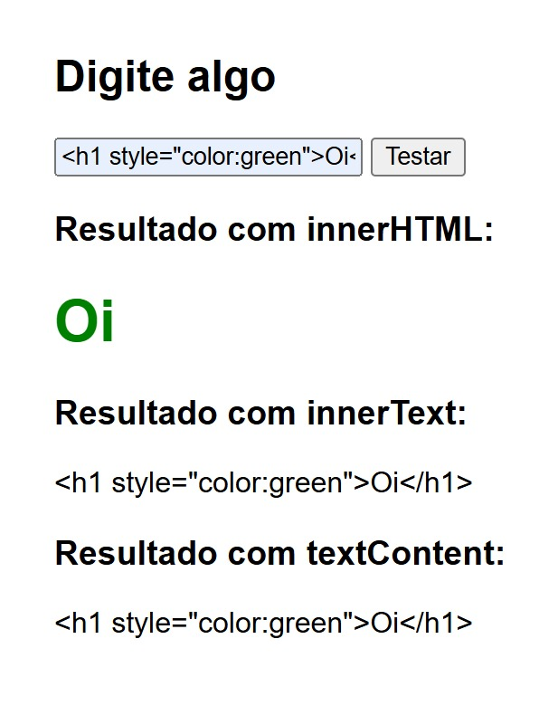

# Teste XSS — innerHTML vs innerText vs textContent

Projeto simples em HTML com JavaScript embutido para demonstrar as diferenças entre `innerHTML`, `innerText` e `textContent`, mostrando como entradas do usuário podem afetar a página e evidenciar riscos básicos de **XSS (Cross-Site Scripting)**.

## Preview



## Funcionalidades

* Campo para digitação de texto pelo usuário.
* Exibição do conteúdo usando:

  * `innerHTML`
  * `innerText`
  * `textContent`
* Validação simples de campo vazio.
* Demonstração de como conteúdo pode ser interpretado como HTML.
* Exemplo de como dados poderiam ser enviados para um servidor usando `fetch`.

## Tecnologias

* HTML5
* CSS
* JavaScript puro (sem bibliotecas externas)

## Estrutura do Projeto

```
teste-xss/
│
├─ preview.png
└─ index.html
```

## Como usar

Clone o projeto:

```
git clone https://github.com/DevLabatut/teste-xss.git
```

Entre na pasta:

```
cd teste-xss
```

Abra o arquivo no navegador:

```
index.html
```

Digite um conteúdo e clique em **Testar** para ver as diferenças entre os métodos.

## Exemplos para teste

Você pode testar entradas como:

```
<b>Texto em negrito</b>
```

ou

```

```

para entender como o navegador interpreta o conteúdo.

## Observações de segurança

* Projeto feito apenas para aprendizado.
* Não possui backend ou armazenamento de dados.
* Nunca utilize `innerHTML` com dados do usuário sem validação ou sanitização.
* Aplicações reais devem filtrar e tratar entradas antes de exibir conteúdo.

## Autor

| [<br><sub>DevLabatut</sub>](https://github.com/DevLabatut) |
| :---------------------------------------------------------------------------------------------------------------: |
